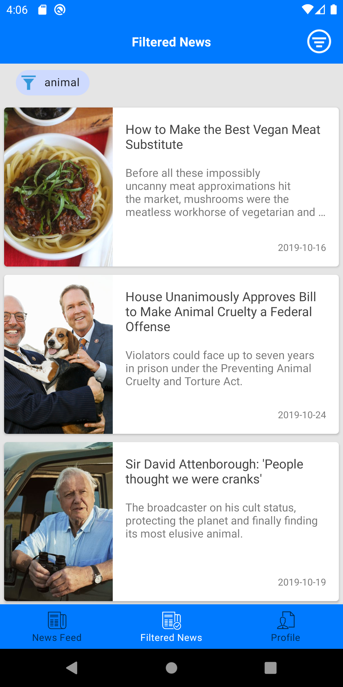
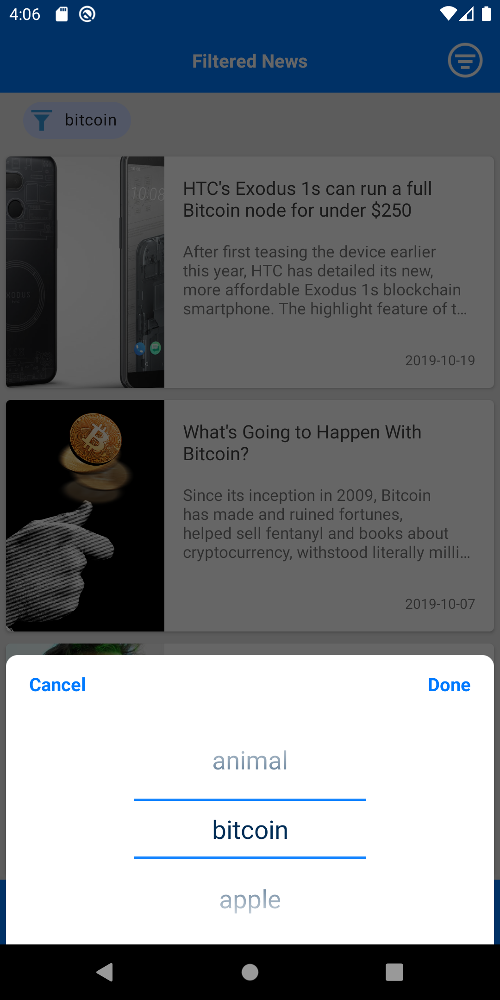
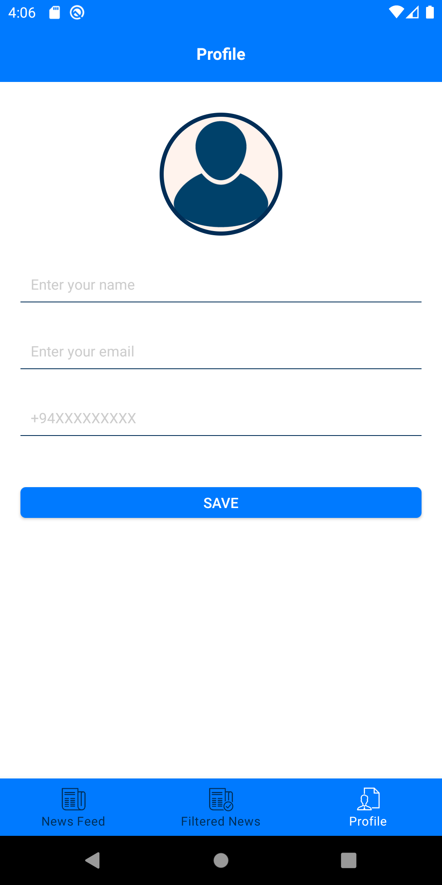

# Android News Feed Application
Android(Kotlin) News Feed application 

This Repositary contains the implementation of the News Feed application for
the Android platform using `Kotlin`,You can run the application using Android studio either directly 
open `(File/open)` the application using Android Studio or import the application
using Android Studio like below. 
open `Android Studio => File => New => Import Project`.

## Structure *********

* `build.gradle` - root gradle config file
* `settings.gradle` - root gradle settings file
* `app` - our only project in this repo
* `app/build.gradle` - project gradle config file
* `app/src` - main project source directory
* `app/src/main` - main project flavour
* `app/src/main/AndroidManifest.xml` - manifest file
* `app/src/main/java` - java source directory
* `app/src/main/res` - resources directory
* `res/layout/*` - This directory contains XML files describing user interface
	view hierarchies.  The activity_main.xml file here is used by
	MainActivity.java to construct its UI.  The base name of each file
	(all text before a '.' character) is taken as the resource name;
	it must be lower-case.
* `res/values/colors.xml , res/values/strings.xml ,res/values/styles.xml` - These XML files describe additional resources included in the application.
	They all use the same syntax; all of these resources could be defined in one
	file, but we generally split them apart as shown here to keep things organized.

## Suport Android version
* `Android 5.0 (API level 21) and above`

## Tested Android versions

* `Android 5.1 (API level 21) Lollipop `
* `Android 6.0 (API level 23) Marshmallow`
* `Android 7.0 (API level 25) Nougat`
* `Android 8.0 (API level 27) Oreo	`
* `Android 9.0 (API level 28) Pie`
* `Android 10.0 (API level 29) Q`

## Screen shots

